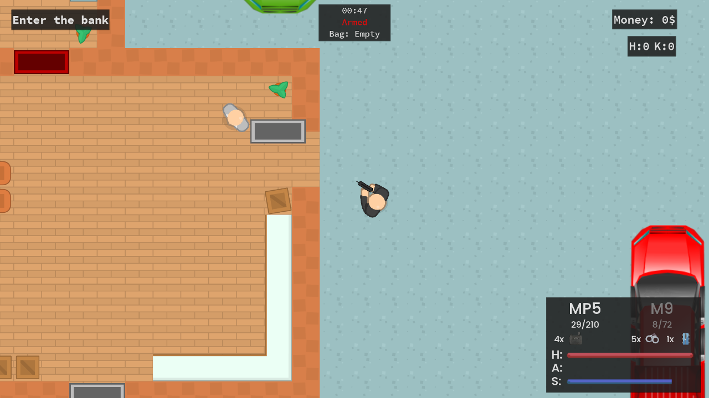
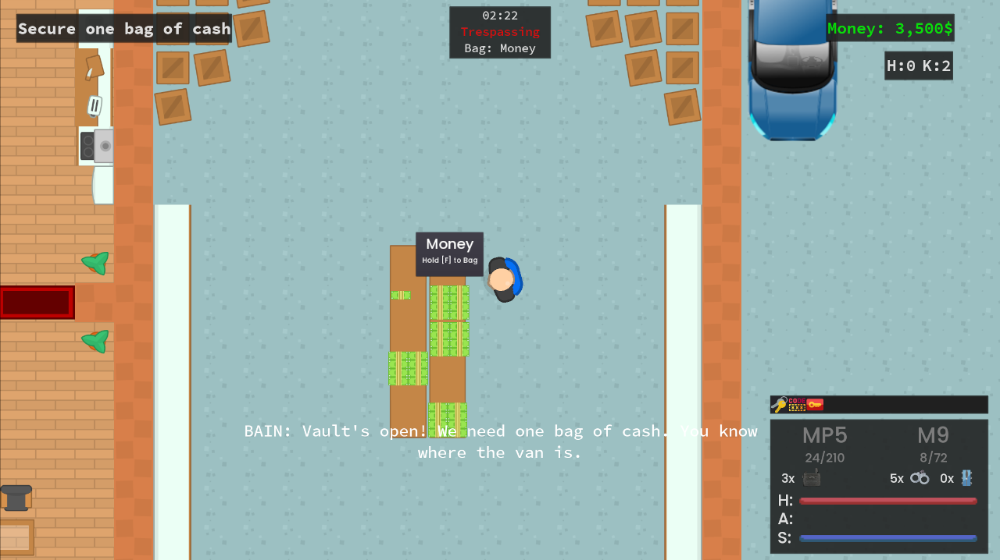
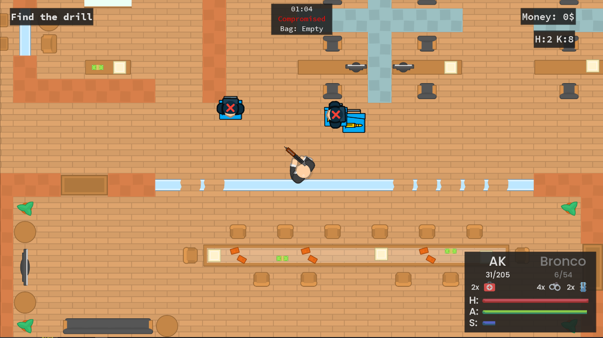
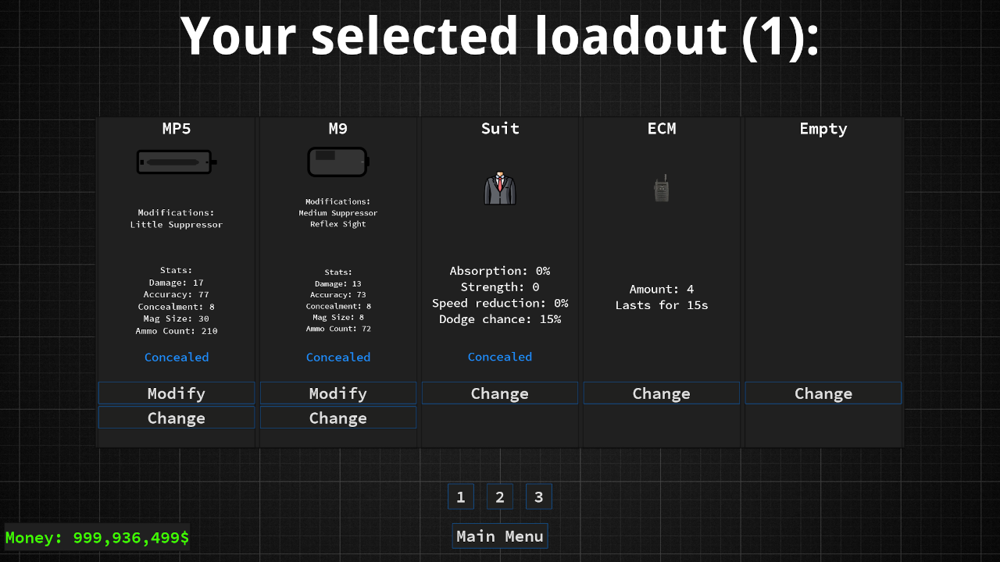
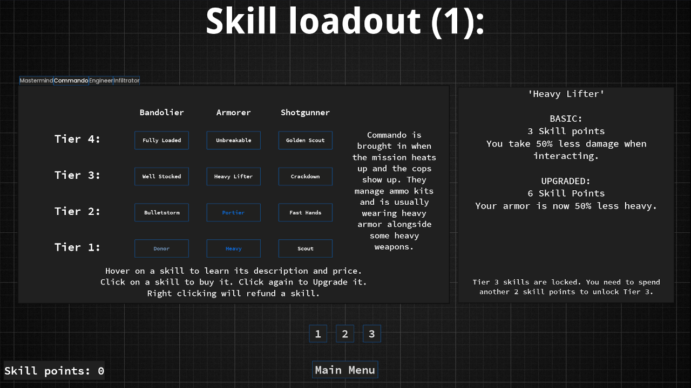

# Infamy
2D Top-down Bank Robbing game made in Godot

Play the game here: https://sp4r0w.itch.io/infamy

### About
-------------
This is my biggest project currently made in Godot. It is a 2D Payday-like game, but with some new mechanics. I'm honestly surprised how good it looks and plays considering many difficulties I had making this.  
This project features:
<ul>
  <li>Fully playlable map with both stealth and loud approaches</li>
  <li>15+ different weapons, each having modifications</li>
  <li>48 skills, each with basic and upgraded version</li>
  <li>AI and randomness thrown in to the map</li>
  <li>A tutorial mission</li>
</ul>
With such a big project, it is unfortunate that the code doesn't really feel the cleanest at some points. This was a good lesson for me on how to create bigger games like this in the future. I will definitely improve upon this in the future  
I also regret not adding in any multiplayer features. It would have been great to play with even one friend together and rob banks and shoot people. Maybe I'll add it in the future, who knows. 

I did some small clean up and added comments in some parts but it's still not finished. I will add more comments in the future.  
I uploaded this repo and preserved the game for me to look at how much I improve over time. So far, I think I've definitely came far.  
Feel free to improve upon this code if you wish to do so or add new maps/features :)

### Getting Started
-------------
To compile this project, you will need at least Godot v3.5.1. Do not forget you will need the required export templates.   
More in-depth guide is avaiable here: https://docs.godotengine.org/en/stable/tutorials/export/exporting_projects.html  
You're free to modify the project as you wish.

### Credits
-------------
I will only list some credits here, as the full list is in the game itself, in the Credits menu.  
Thanks to DipShtick (Varga), loscracks900, TheOGWilly (Aqua) and SpR1nT for testing.  
Most graphical assets were made by Kenney (https://kenney.nl/)  
I used Godot Dark Theme (modified by me) by Mounir Tohami (https://mounirtohami.itch.io/godot-dark-theme)  
Music was taken from Payday 2 (Simon Viklund) and Entry Point (many different composers lol)  
Sound effects were made by GameAudio (https://freesound.org/people/GameAudio/)  
Fonts used are Poppins by Indian Type Foundry and Jonny Pinhorn, Source Code Pro by Paul D. Hunt and Droid Sans by Ascender Corporation.  

### Preview
-------------

Play the game here: https://sp4r0w.itch.io/infamy
